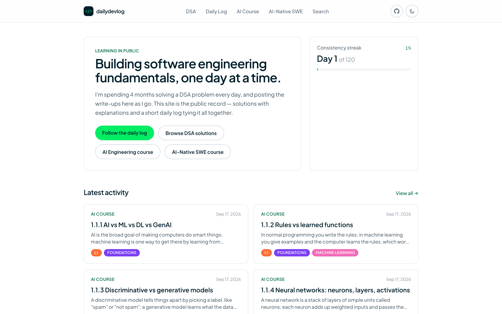
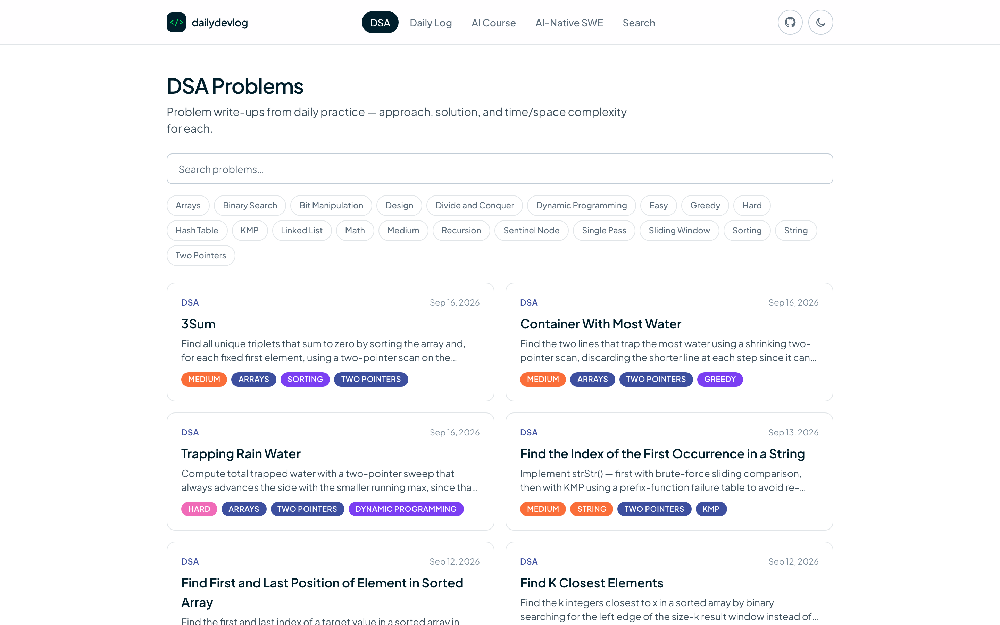
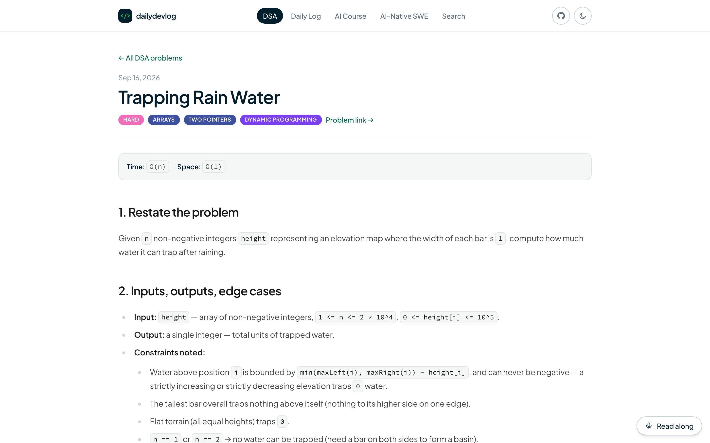
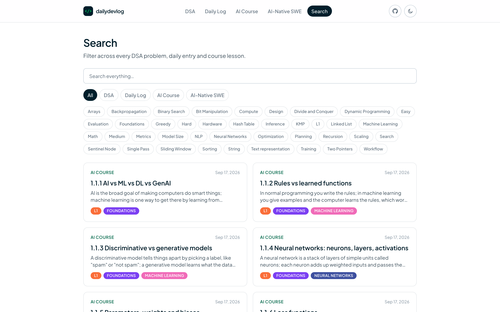
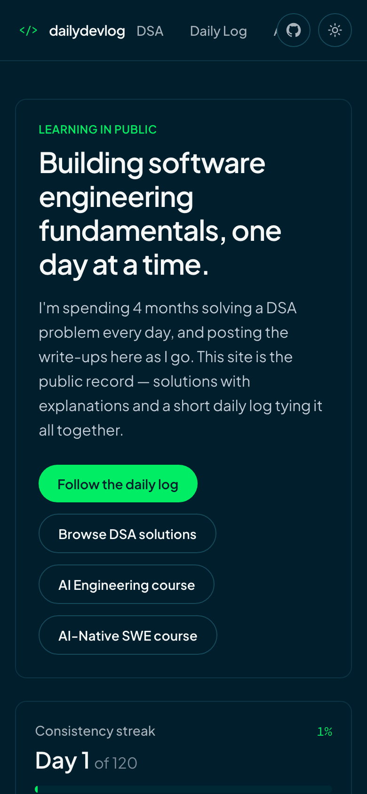
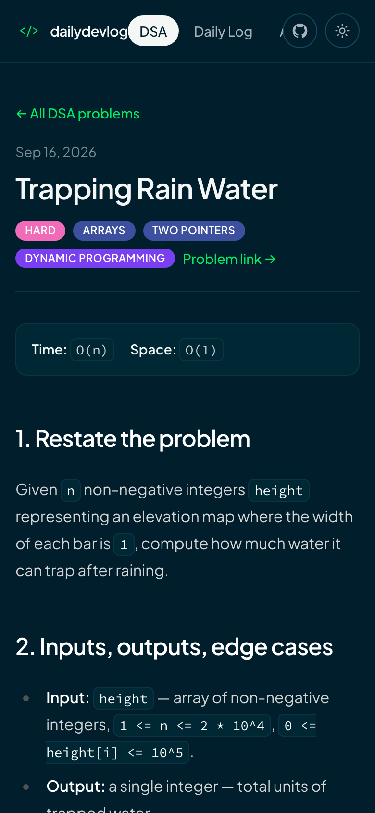

<div align="center">

# `</>` dailydevlog

**Building software engineering fundamentals, one day at a time.**

A "learning in public" site: a DSA problem every day and a short daily log,
all updated over a 120-day learning journey.

[](https://astro.build)
[](https://tailwindcss.com)
[](https://mdxjs.com)
[](https://www.typescriptlang.org)
[](https://creativecommons.org/licenses/by/4.0/)

[**dailydevlog.com**](https://dailydevlog.com) · [DSA](https://dailydevlog.com/dsa) · [Daily Log](https://dailydevlog.com/daily-log)

<br />

<picture>
  <source media="(prefers-color-scheme: dark)" srcset=".github/screenshots/home-dark.png" />
  
</picture>

</div>

## What's inside

| Section | What you'll find |
| :-- | :-- |
| 🧩 **DSA** | Problem write-ups in a fixed 8-step format: restate, inputs/edge cases, approach, code, complexity and more. Tagged by difficulty and pattern. |
| 📓 **Daily Log** | A short daily entry that ties the day's work together. |
| 🔎 **Search** | Client-side filter across every problem and log entry, by section and tag. |

## Screenshots

> The images follow your GitHub theme. Switch between light and dark to see both.

### DSA problems

<table>
  <tr>
    <td width="50%">
      <picture>
        <source media="(prefers-color-scheme: dark)" srcset=".github/screenshots/dsa-dark.png" />
        
      </picture>
    </td>
    <td width="50%">
      <picture>
        <source media="(prefers-color-scheme: dark)" srcset=".github/screenshots/dsa-post-dark.png" />
        
      </picture>
    </td>
  </tr>
  <tr>
    <td align="center"><sub>Problem list, filterable by difficulty and pattern</sub></td>
    <td align="center"><sub>A write-up in the 8-step format</sub></td>
  </tr>
</table>

### Search

<p align="center">
  <picture>
    <source media="(prefers-color-scheme: dark)" srcset=".github/screenshots/search-dark.png" />
    
  </picture>
  <br />
  <sub>Search across everything, filtered by section and tag</sub>
</p>

### On mobile

<p align="center">
  
  &nbsp;
  
</p>

## Features

- **Content collections + MDX.** Every problem and log entry is an `.mdx` file with a typed schema.
- **Read-along.** On problem pages, the Web Speech API follows your voice and highlights each word as you read it aloud.
- **Consistency streak.** The home page tracks progress through the 120-day journey.
- **Light and dark themes.** Follows the system setting, with a manual toggle.
- **RSS and sitemap**, plus syntax highlighting with Shiki (`github-dark`).

## Tech stack

[Astro 7](https://astro.build) · [Tailwind CSS v4](https://tailwindcss.com) + Typography · [MDX](https://mdxjs.com) ·
`@astrojs/rss` · `@astrojs/sitemap` · TypeScript

## Project structure

```text
src/
├── content/
│   ├── dsa/                     # DSA write-ups (.mdx)
│   └── daily-log/               # daily entries (.mdx)
├── content.config.ts            # collection schemas
├── pages/
│   ├── index.astro              # home: hero, streak, latest activity
│   ├── dsa/  daily-log/         # list + [slug] pages
│   ├── search.astro
│   └── rss.xml.js
├── components/  layouts/  lib/  styles/
```

## Getting started

Requires Node.js **22.12+**.

```sh
git clone https://github.com/Rishabh2324/dailydevlog.com.git
cd dailydevlog.com
npm install
npm run dev
```

To run the dev server in the background instead:

```sh
astro dev --background   # start
astro dev status         # check it's running
astro dev logs           # tail logs
astro dev stop           # stop
```

| Command | Action |
| :-- | :-- |
| `npm run dev` | Start the dev server at `localhost:4321` |
| `npm run build` | Build the static site to `./dist/` |
| `npm run preview` | Preview the production build locally |
| `npx astro check` | Type-check the project |

## Adding content

Add an `.mdx` file to the matching folder under `src/content/` and it's published on the next build.
The schemas in `src/content.config.ts` list the required frontmatter:

- **DSA:** `title`, `difficulty` (Easy/Medium/Hard), `pattern[]`, `date`, `timeComplexity`, `spaceComplexity`, `summary`, optional `problemUrl`
- **Daily log:** `day`, `date`, `summary`, optional `tags[]` and `links[]`

## License

Code is MIT licensed. Written content (DSA write-ups and daily log entries) is licensed under
[CC BY 4.0](https://creativecommons.org/licenses/by/4.0/).
